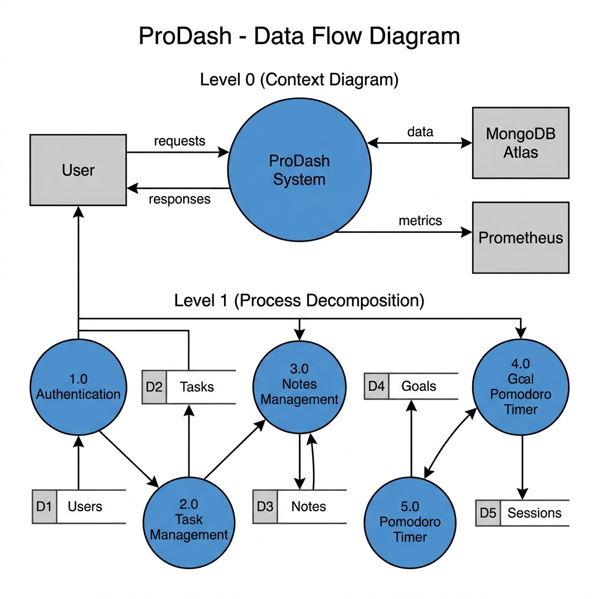
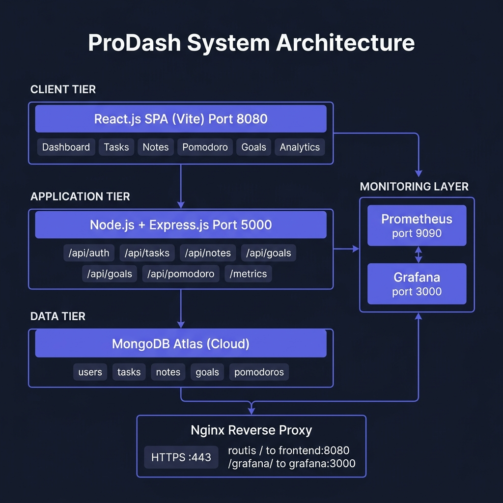
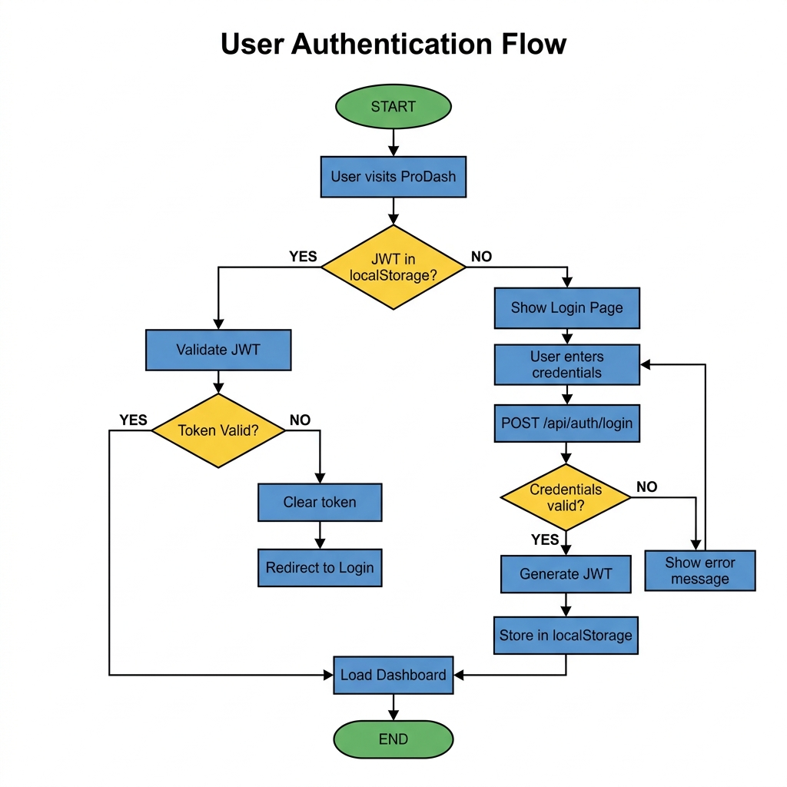
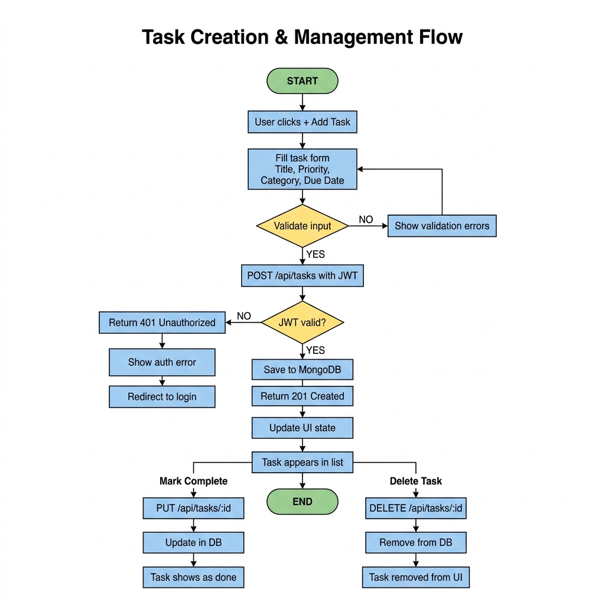
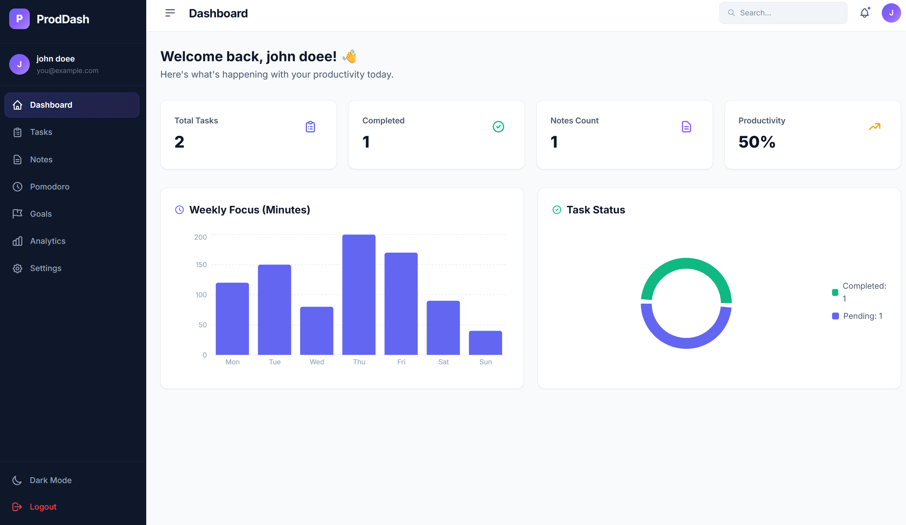
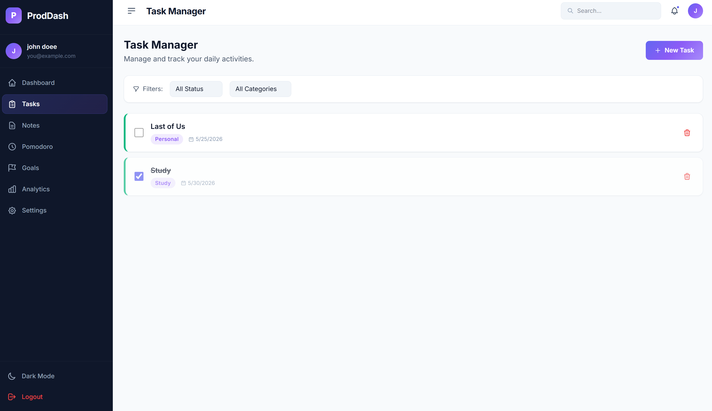
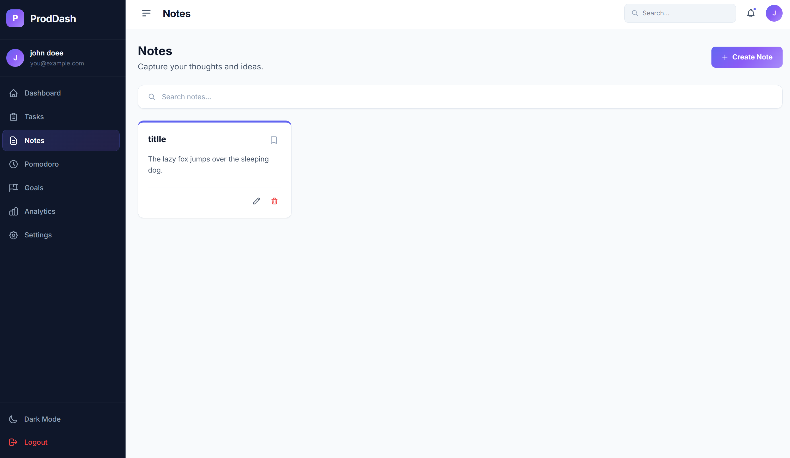
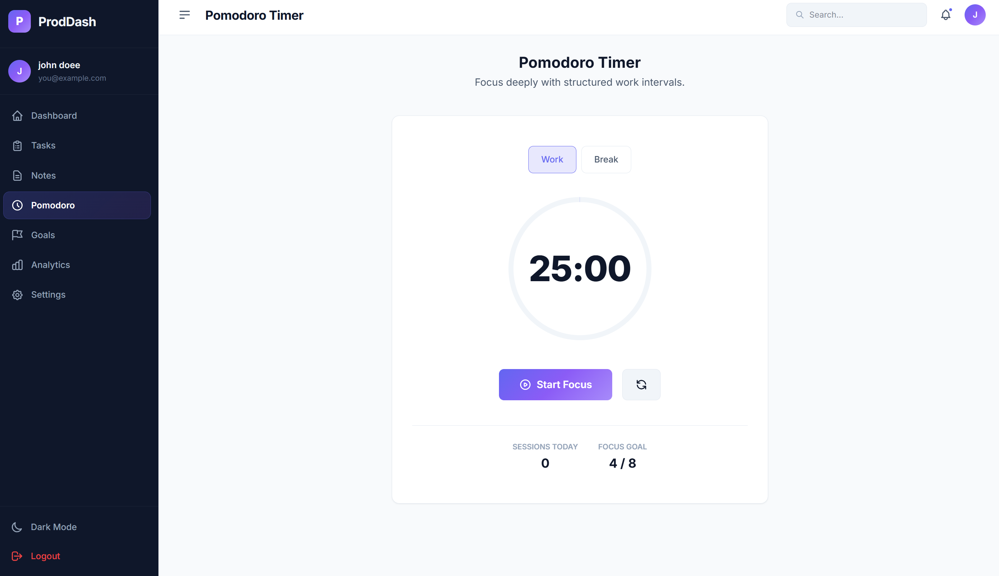

# ProDash - Personal Productivity Dashboard
### Project Report

---

## 1. Introduction

In today's fast-paced world, individuals struggle to manage multiple responsibilities - professional tasks, academic goals, personal notes, and time - across disconnected tools and applications. There exists a clear need for a unified, intelligent platform that consolidates all productivity-related activities into a single, seamless experience.

**ProDash** (Productivity Dashboard) is a full-stack web application designed to address this need. It provides users with a centralized hub to manage tasks, capture notes, set and track daily goals, maintain focus using the Pomodoro technique, and visualize their productivity trends through interactive analytics.

The application is built using modern web technologies - React.js on the frontend, Node.js and Express.js on the backend, and MongoDB Atlas as the database. It is fully containerized using Docker and deployed on a Linux server with HTTPS support via Let's Encrypt, accessible at https://prodash.duckdns.org.

The system also incorporates real-time monitoring using Prometheus and Grafana, giving developers visibility into application health, request rates, latency, memory usage, and CPU performance.

---

## 2. Profile of the Problem - Rationale / Scope of the Study (Problem Statement)

### Problem Statement

Modern users rely on a fragmented set of tools for productivity: separate apps for tasks, notes, timers, and goal-setting. This fragmentation leads to context-switching, loss of data coherence, and reduced efficiency. There is no single platform that:

- Tracks tasks with priorities and categories
- Stores notes with search and pin functionality
- Measures focused work time with a Pomodoro timer
- Tracks daily goals with streaks
- Visualizes all productivity data in one analytics view

### Rationale

The rationale for ProDash is to eliminate the overhead of juggling multiple productivity tools. By building a cohesive, data-driven dashboard with a unified identity, users can focus entirely on their work rather than their tools.

### Scope of the Study

The scope of this project includes:

- Design and development of a responsive, full-stack web application
- Implementation of secure user authentication (JWT + bcrypt)
- CRUD operations for tasks, notes, goals, and Pomodoro sessions
- Interactive analytics using chart libraries
- Containerized deployment using Docker and Docker Compose
- Real-time server monitoring with Prometheus and Grafana
- CI/CD automation using GitHub Actions
- HTTPS deployment on a live server with a custom domain

---

## 3. Existing System (If Applicable)

### Introduction

Before ProDash, the typical user would rely on a combination of tools such as:

- **Microsoft To-Do / Todoist** - for task management
- **Notion / Google Keep** - for note-taking
- **Forest / Focus Booster** - for Pomodoro timing
- **Google Sheets / Habitica** - for goal tracking

### Existing Software

| Tool | Purpose | Limitation |
|------|---------|------------|
| Todoist | Task management | No integrated notes or goals |
| Google Keep | Notes | No task tracking or analytics |
| Forest App | Pomodoro timer | No cross-feature data visibility |
| Notion | All-in-one workspace | Complex setup, steep learning curve, not self-hosted |

### DFD for Present System (Existing System)



**Problem:** No shared context, no unified analytics, no single login.

### What's New in the System to Be Developed

ProDash introduces the following improvements over existing systems:

1. **Unified Authentication** - one account, all features
2. **Cross-feature Analytics** - tasks, goals, and Pomodoro sessions feed into a single analytics view
3. **Self-hosted and Private** - user data is stored in a personal MongoDB Atlas database
4. **Real-time Monitoring** - Prometheus + Grafana for backend observability
5. **Dark/Light Mode** - modern UI with theme persistence
6. **Fully Deployed** - accessible via HTTPS on a live domain

---

## 4. Problem Analysis

### Product Definition

**ProDash** is a personal productivity web application that enables authenticated users to:

- Create and manage tasks with priorities, categories, and due dates
- Write and pin notes with color themes and search
- Run Pomodoro focus sessions with configurable intervals
- Set and track daily goals with streak counters
- View productivity analytics (bar charts, area charts, pie charts)

**Target Users:** Students, professionals, freelancers, and anyone seeking an organized digital workspace.

### Feasibility Analysis

#### Technical Feasibility
All technologies used (React, Node.js, MongoDB, Docker) are mature, well-documented, and freely available. The developer has prior experience with the MERN stack. Deployment is achievable using free-tier cloud infrastructure (MongoDB Atlas, DuckDNS).

#### Operational Feasibility
The system is web-based and requires only a browser. No installation is needed on the client side. The responsive design ensures usability on mobile, tablet, and desktop.

#### Economic Feasibility
The project uses entirely open-source technologies. Hosting costs are minimized using a self-managed Linux VPS. There are no licensing fees.

#### Time Feasibility
The project was scoped and completed within the academic semester. Features were prioritized to deliver a working MVP with core modules (auth, tasks, notes, goals, Pomodoro, analytics) before extending to monitoring.

### Project Plan

| Phase | Activity | Status |
|-------|----------|--------|
| Phase 1 | Requirement gathering, tech stack selection | Completed |
| Phase 2 | UI/UX design, component architecture | Completed |
| Phase 3 | Backend API development (auth, CRUD routes) | Completed |
| Phase 4 | Frontend development (pages, contexts, services) | Completed |
| Phase 5 | Docker containerization | Completed |
| Phase 6 | CI/CD pipeline (GitHub Actions) | Completed |
| Phase 7 | HTTPS deployment with Nginx reverse proxy | Completed |
| Phase 8 | Prometheus + Grafana monitoring setup | Completed |
| Phase 9 | Testing and documentation | Completed |

---

## 5. Software Requirement Analysis

### Introduction

This section outlines the functional and non-functional requirements of ProDash. Requirements were gathered by analyzing limitations of existing productivity tools and identifying features that would provide a holistic productivity experience.

### General Description

ProDash is a Single Page Application (SPA) served over HTTPS. The frontend communicates with a RESTful backend API. User data is persisted in MongoDB Atlas. The application supports dark and light themes, is fully responsive, and provides real-time data via API calls.

### Specific Requirements

#### Functional Requirements

**Authentication**
- FR-01: Users shall be able to register with name, email, and password
- FR-02: Passwords shall be hashed using bcryptjs before storage
- FR-03: Users shall receive a JSON Web Token (JWT) upon successful login
- FR-04: Protected routes shall require a valid JWT in the Authorization header

**Task Manager**
- FR-05: Users shall be able to create, read, update, and delete tasks
- FR-06: Tasks shall have title, description, priority (Low/Medium/High), category, due date, and completion status
- FR-07: Tasks shall be filterable by status and category

**Notes**
- FR-08: Users shall be able to create, edit, pin, and delete notes
- FR-09: Notes shall support custom color themes
- FR-10: Notes shall be searchable by title and content

**Pomodoro Timer**
- FR-11: Users shall be able to configure work and break intervals
- FR-12: Completed Pomodoro sessions shall be logged with timestamp and duration

**Goals**
- FR-13: Users shall be able to set daily goals with title and target
- FR-14: Goal completion shall update streak counters

**Analytics**
- FR-15: The analytics page shall display task completion trends as bar and area charts
- FR-16: Category distribution shall be shown as a pie chart
- FR-17: All charts shall use data from the authenticated user's records

#### Non-Functional Requirements

- NFR-01: API response time shall be under 500ms for standard CRUD operations
- NFR-02: The application shall support HTTPS with TLS 1.2/1.3
- NFR-03: The system shall be containerized for reproducible deployments
- NFR-04: The UI shall be responsive for screen widths from 320px to 2560px
- NFR-05: Prometheus metrics shall be scraped every 15 seconds
- NFR-06: Memory usage per container shall be limited (Backend: 250MB, Prometheus: 150MB, Grafana: 250MB, Frontend: 50MB)

---

## 6. Design

### System Design

ProDash follows a 3-tier architecture:



### Design Notations

**API Endpoint Structure:**

| Method | Endpoint | Description |
|--------|----------|-------------|
| POST | /api/auth/register | Register new user |
| POST | /api/auth/login | Login, returns JWT |
| GET | /api/tasks | Get all tasks for user |
| POST | /api/tasks | Create new task |
| PUT | /api/tasks/:id | Update task |
| DELETE | /api/tasks/:id | Delete task |
| GET | /api/notes | Get all notes |
| POST | /api/notes | Create note |
| GET | /api/goals | Get all goals |
| POST | /api/goals | Create goal |
| GET | /api/pomodoro | Get Pomodoro sessions |
| POST | /api/pomodoro | Log Pomodoro session |
| GET | /metrics | Prometheus metrics endpoint |

### Detailed Design

#### Database Schema

**User Model**
```
User {
  name:      String (required)
  email:     String (required, unique)
  password:  String (hashed, required)
  createdAt: Date
}
```

**Task Model**
```
Task {
  user:        ObjectId (ref: User)
  title:       String (required)
  description: String
  priority:    Enum [Low, Medium, High]
  category:    Enum [Work, Study, Personal, ...]
  dueDate:     Date
  completed:   Boolean (default: false)
  createdAt:   Date
}
```

**Note Model**
```
Note {
  user:      ObjectId (ref: User)
  title:     String
  content:   String
  color:     String
  pinned:    Boolean (default: false)
  createdAt: Date
}
```

**Goal Model**
```
Goal {
  user:      ObjectId (ref: User)
  title:     String (required)
  target:    Number
  current:   Number
  streak:    Number
  date:      Date
}
```

**Pomodoro Model**
```
Pomodoro {
  user:      ObjectId (ref: User)
  duration:  Number (minutes)
  type:      Enum [work, break]
  createdAt: Date
}
```

#### Frontend Component Architecture

```
App.jsx
|-- AuthContext        (JWT, user state)
|-- ThemeContext       (dark/light mode)
|-- LandingPage
|-- LoginPage
|-- SignupPage
+-- Layout (Sidebar + Outlet)
    |-- Dashboard      (overview widgets)
    |-- Tasks          (task CRUD)
    |-- Notes          (notes CRUD)
    |-- Pomodoro       (timer + session log)
    |-- Goals          (goal tracking)
    |-- Analytics      (Recharts graphs)
    +-- Settings       (preferences)
```

#### Monitoring Architecture

```
prometheus.yml
  scrape_configs:
    - job: prometheus -> prometheus:9090
    - job: backend    -> backend:5000/metrics

prom-client (Node.js):
  - Default metrics: CPU, memory, event loop
  - Custom: http_request_duration_seconds (histogram)
    labels: method, route, status_code
```

### Flowcharts

**User Authentication Flow:**



**Task Creation and Management Flow:**



### Pseudo Code

**JWT Middleware (Backend)**
```
function verifyToken(req, res, next):
  token = req.headers.authorization.split(' ')[1]
  if not token:
    return 401 Unauthorized
  decoded = jwt.verify(token, JWT_SECRET)
  if error:
    return 401 Invalid token
  req.user = decoded
  next()
```

**Prometheus Metrics Middleware (Backend)**
```
app.use((req, res, next):
  timer = httpDurationHistogram.startTimer()
  res.on('finish'):
    timer({ method, route, status_code })
  next()
```

---

## 7. Testing

### Functional Testing

Functional testing was carried out manually by simulating user interactions across all modules.

| Test Case | Input | Expected Output | Result |
|-----------|-------|-----------------|--------|
| TC-01: Register new user | Valid name, email, password | 201 Created + JWT | Pass |
| TC-02: Login with wrong password | Invalid password | 401 Unauthorized | Pass |
| TC-03: Create task without auth | No JWT header | 401 Unauthorized | Pass |
| TC-04: Create task with valid data | Title, priority, category | 201 Created + task | Pass |
| TC-05: Mark task complete | Task ID, completed=true | Task updated | Pass |
| TC-06: Create pinned note | Note with pinned=true | Note pinned in UI | Pass |
| TC-07: Pomodoro session logging | Duration, type | Session stored | Pass |
| TC-08: Goal streak increment | Complete goal today | Streak +1 | Pass |
| TC-09: Analytics chart render | User has tasks/goals | Charts rendered | Pass |
| TC-10: Theme toggle | Click toggle | Theme switches | Pass |

### Structural Testing

**Unit-level structural testing** was performed on:

- **Route handlers:** Each Express route handler was tested in isolation using curl and Postman
- **JWT middleware:** Tested with expired, malformed, and valid tokens
- **Mongoose models:** Schema validation tested with missing required fields

**Code paths tested:**
- Happy path: valid data, authenticated user
- Error path: missing fields, expired JWT, duplicate email
- Edge cases: empty task list, zero Pomodoro sessions

### Levels of Testing

| Level | Type | Tool Used |
|-------|------|-----------|
| Unit | Route handler logic | Manual (curl/Postman) |
| Integration | Frontend <-> Backend API | Browser DevTools + Network tab |
| System | Full user workflow end-to-end | Manual browser testing |
| Deployment | Docker container health | docker ps, health endpoint |
| Monitoring | Prometheus scrape targets | Grafana up metric |

### Testing the Project

**API Testing (Postman/curl):**

```bash
# Register
curl -X POST https://prodash.duckdns.org/api/auth/register \
  -H "Content-Type: application/json" \
  -d '{"name":"Test","email":"test@test.com","password":"pass123"}'

# Login
curl -X POST https://prodash.duckdns.org/api/auth/login \
  -H "Content-Type: application/json" \
  -d '{"email":"test@test.com","password":"pass123"}'

# Create Task (with JWT)
curl -X POST https://prodash.duckdns.org/api/tasks \
  -H "Authorization: Bearer <token>" \
  -H "Content-Type: application/json" \
  -d '{"title":"Study","priority":"High","category":"Study"}'
```

**Health Check:**
```bash
curl https://prodash.duckdns.org/api/health
# Response: {"status":"ok","timestamp":"2026-05-24T..."}
```

**Prometheus Metrics Verification:**
```
up{job="prometheus"} = 1   (ok)
up{job="backend"}    = 1   (ok)
```

---

## 8. Implementation

### Implementation of the Project

ProDash was implemented in phases using an iterative development approach.

**Phase 1 - Backend API**
The Express.js server was set up with middleware for CORS, JSON parsing, and JWT authentication. Mongoose models were created for all five data entities. RESTful routes were implemented for auth, tasks, notes, goals, and Pomodoro sessions. The prom-client library was integrated to expose a /metrics endpoint for Prometheus scraping.

**Phase 2 - Frontend Application**
A React.js SPA was bootstrapped using Vite. The AuthContext manages JWT storage and user state. The ThemeContext handles dark/light mode with CSS variable switching. Pages were built for each feature module. Recharts was integrated for the analytics visualizations.

**Phase 3 - Containerization**
Each service (frontend, backend, Prometheus, Grafana) was containerized using Docker. A docker-compose.yml orchestrates all services on a shared Docker network, enabling inter-container DNS resolution (e.g., backend:5000, prometheus:9090). Memory limits were applied to each container.

**Phase 4 - CI/CD Pipeline**
A GitHub Actions workflow was configured to automatically deploy on every push to main. The workflow SSHs into the production server, pulls the latest code, and runs docker compose up -d --build.

**Phase 5 - Production Deployment**
The application is deployed on a Linux VPS. Nginx acts as a reverse proxy, routing traffic from HTTPS port 443 to the appropriate Docker containers. Let's Encrypt provides free TLS certificates, managed by Certbot. The domain prodash.duckdns.org is a free DuckDNS subdomain pointing to the server's public IP.

### Conversion Plan

The project transitioned from local development to production through the following steps:

1. Local development with npm run dev (Vite) and nodemon server.js
2. Docker images built and tested locally with docker compose up
3. GitHub repository configured with Actions secrets (SSH key, host, username)
4. VPS provisioned with Docker, Nginx, and Certbot installed
5. DNS configured: DuckDNS domain -> server public IP
6. SSL certificate obtained: certbot --nginx -d prodash.duckdns.org
7. Nginx config updated with proxy_pass blocks for frontend, Grafana
8. First deployment triggered manually, subsequent deployments via GitHub Actions

### Post-Implementation and Software Maintenance

**Monitoring and Alerting:**
Prometheus scrapes backend metrics every 15 seconds. Grafana dashboards visualize HTTP request rates, p95 latency, memory usage, and CPU utilization. The up metric provides liveness status for all scrape targets.

**Data Retention:**
Prometheus is configured with a 500MB storage retention limit. MongoDB Atlas provides automated backups on the cloud.

**Maintenance Tasks:**
- SSL certificate auto-renewal: managed by Certbot cron job
- Docker image updates: trigger via git push to main
- Log monitoring: docker compose logs -f backend
- Dependency updates: npm audit and manual review

---

## 9. Project Legacy

### Current Status of the Project

ProDash is fully deployed and operational at https://prodash.duckdns.org. All core features are functional:

- [x] User registration and login (JWT authentication)
- [x] Task management (CRUD, priorities, categories)
- [x] Notes (CRUD, pin, color, search)
- [x] Pomodoro timer with session logging
- [x] Daily goals with streak tracking
- [x] Analytics dashboard (bar, area, pie charts)
- [x] Dark/Light mode
- [x] Docker deployment with resource limits
- [x] CI/CD via GitHub Actions
- [x] HTTPS with Let's Encrypt
- [x] Prometheus + Grafana monitoring

### Remaining Areas of Concern

1. **Authentication Security:** The application currently uses email/password only. Adding OAuth (Google login) would improve usability and security.
2. **Rate Limiting:** No rate limiting is implemented on the API. A library like express-rate-limit should be added to prevent brute-force attacks.
3. **Input Sanitization:** Additional server-side input validation should be added using a library like express-validator.
4. **Prometheus Auth:** The /metrics endpoint is currently accessible without authentication. It should be protected in production.
5. **Email Notifications:** No email system is integrated. Features like due date reminders would require an email service (e.g., SendGrid).
6. **Offline Support:** The app has no offline capability. A service worker / PWA setup would improve mobile usability.
7. **Unit Test Coverage:** Automated test coverage using Jest/Vitest is not yet implemented.

### Technical and Managerial Lessons Learnt

**Technical:**
- Docker inter-container DNS works via service names, not localhost - a critical distinction learned during Prometheus configuration
- JWT expiry and refresh token strategies are essential for production-grade authentication
- Nginx proxy_pass with subpath routing requires careful attention to trailing slashes and proxy_set_header configuration
- Prometheus's prometheus_build_info metric is what drives dashboard template variable population - using localhost inside Docker breaks this

**Managerial:**
- Iterative development (feature by feature) was more effective than trying to build all modules simultaneously
- Deploying early (even with incomplete features) surfaced environment-specific bugs that local development never exposed
- CI/CD automation pays dividends quickly - after initial setup, deployments became zero-effort
- Monitoring should be set up early, not as an afterthought - it helps catch performance regressions immediately

---

## 10. User Manual

### Getting Started

**Access the Application:**
Open a browser and navigate to https://prodash.duckdns.org

**Create an Account:**
1. Click **Get Started** on the landing page
2. Fill in your name, email, and password
3. Click **Sign Up**
4. You will be redirected to the main dashboard automatically

**Login:**
1. Click **Login** on the landing page
2. Enter your registered email and password
3. Click **Login** - you will be taken to the Dashboard

---

### Dashboard
The Dashboard gives an overview of your productivity:
- **Today's Stats:** Tasks due today, goals completed, Pomodoro sessions
- **Recent Tasks:** Quick view of your latest tasks
- **Goal Progress:** Visual progress bars for today's goals



---

### Tasks
1. Click **Tasks** in the left sidebar
2. Click **+ New Task** to create a new task
3. Fill in: Title, Description (optional), Priority, Category, Due Date
4. Click **Save**
5. To mark a task complete: click the checkbox next to it
6. To delete: click the trash icon on the task card
7. Use the **Filter** buttons to view All Status / All Categories



---

### Notes
1. Click **Notes** in the sidebar
2. Click **+ Create Note** to create a note
3. Enter a title and content
4. Choose a colour theme for the note card
5. Click the **pin icon** to pin important notes to the top
6. Use the **search bar** to find notes by title or content
7. To edit or delete: click the pencil or trash icon on the note card



---

### Pomodoro Timer
1. Click **Pomodoro** in the sidebar
2. Select **Work** or **Break** tab
3. Click **Start Focus** to begin a 25-minute focus session
4. The timer counts down in the circular ring
5. Sessions Today and Focus Goal are tracked automatically



---

### Goals
1. Click **Goals** in the sidebar
2. Click **+ Add Goal** to create a daily goal
3. Enter the goal title and target value
4. As you make progress, update the current value
5. Completing a goal increments your **streak counter**

---

### Analytics
1. Click **Analytics** in the sidebar
2. View:
   - **Task Completion Trend** - bar chart of tasks completed over time
   - **Productivity Area Chart** - area chart of daily activity
   - **Category Distribution** - pie chart of task categories
3. All charts auto-update based on your data

---

### Settings
1. Click **Settings** in the sidebar
2. Update your **display name** or **email**
3. Change your **password**
4. Toggle **Dark / Light Mode** (also available in the sidebar bottom)

---

### Logging Out
Click **Logout** at the bottom of the left sidebar to securely end your session.

---

## 11. Source Code and System Snapshots

### Project Repository Structure

```
ProductivityDashboard/
|-- backend/
|   |-- config/
|   |   +-- db.js                  # MongoDB connection
|   |-- controllers/               # Route handler logic
|   |-- middleware/                # JWT auth middleware
|   |-- models/
|   |   |-- User.js
|   |   |-- Task.js
|   |   |-- Note.js
|   |   |-- Goal.js
|   |   +-- Pomodoro.js
|   |-- routes/
|   |   |-- authRoutes.js
|   |   |-- taskRoutes.js
|   |   |-- noteRoutes.js
|   |   |-- goalRoutes.js
|   |   +-- pomodoroRoutes.js
|   |-- server.js                  # Express entry point
|   +-- Dockerfile
|-- frontend/
|   |-- src/
|   |   |-- components/
|   |   |   +-- layout/
|   |   |       +-- Sidebar.jsx
|   |   |-- context/
|   |   |   |-- AuthContext.jsx
|   |   |   +-- ThemeContext.jsx
|   |   |-- pages/
|   |   |   |-- Dashboard.jsx
|   |   |   |-- Tasks.jsx
|   |   |   |-- Notes.jsx
|   |   |   |-- Pomodoro.jsx
|   |   |   |-- Goals.jsx
|   |   |   |-- Analytics.jsx
|   |   |   |-- Settings.jsx
|   |   |   |-- LandingPage.jsx
|   |   |   |-- LoginPage.jsx
|   |   |   +-- SignupPage.jsx
|   |   |-- services/              # Axios API config
|   |   |-- App.jsx
|   |   |-- main.jsx
|   |   +-- index.css              # Design system (CSS variables)
|   +-- Dockerfile
|-- prometheus/
|   +-- prometheus.yml             # Scrape configuration
|-- .github/
|   +-- workflows/
|       +-- deploy.yml             # GitHub Actions CI/CD
|-- docker-compose.yml             # Multi-container orchestration
+-- README.md
```

### Deployment Architecture Snapshot

```
Internet
    |
    v HTTPS :443
[Nginx Reverse Proxy] (host)
    |
    |-- /           -> [Frontend Container] :8080  (React SPA)
    +-- /grafana/   -> [Grafana Container]  :3000  (Monitoring UI)

[Docker Bridge Network]
    |-- frontend   (nginx, port 8080)
    |-- backend    (node:alpine, port 5000)
    |-- prometheus (prom/prometheus, port 9090)
    +-- grafana    (grafana/grafana, port 3000)

[External Services]
    +-- MongoDB Atlas (cloud database)

[CI/CD]
    GitHub push -> GitHub Actions -> SSH -> docker compose up --build
```

### Key Configuration Files

**docker-compose.yml (excerpt):**
```yaml
services:
  backend:
    build: ./backend
    ports: ["5000:5000"]
    deploy:
      resources:
        limits:
          memory: 250M

  prometheus:
    image: prom/prometheus:latest
    volumes:
      - ./prometheus/prometheus.yml:/etc/prometheus/prometheus.yml
    command:
      - '--config.file=/etc/prometheus/prometheus.yml'
      - '--storage.tsdb.retention.size=500MB'
```

**prometheus.yml:**
```yaml
global:
  scrape_interval: 15s

scrape_configs:
  - job_name: 'prometheus'
    static_configs:
      - targets: ['prometheus:9090']

  - job_name: 'backend'
    metrics_path: '/metrics'
    static_configs:
      - targets: ['backend:5000']
    relabel_configs:
      - source_labels: [__address__]
        target_label: instance
        replacement: 'productivity-dashboard-backend'
```

**GitHub Actions (deploy.yml excerpt):**
```yaml
on:
  push:
    branches: [main]

jobs:
  deploy:
    runs-on: ubuntu-latest
    steps:
      - name: Deploy to server
        uses: appleboy/ssh-action@v1
        with:
          host: ${{ secrets.HOST }}
          username: ${{ secrets.USERNAME }}
          key: ${{ secrets.SSH_KEY }}
          script: |
            cd ~/ProductivityDashboard
            git pull origin main
            docker compose up -d --build
```

---

## 12. Bibliography

1. **React.js Documentation** - Meta Open Source
   https://react.dev

2. **Node.js Documentation** - OpenJS Foundation
   https://nodejs.org/en/docs

3. **Express.js Guide** - StrongLoop / OpenJS Foundation
   https://expressjs.com/en/guide

4. **Mongoose ODM Documentation**
   https://mongoosejs.com/docs/

5. **MongoDB Atlas Documentation** - MongoDB Inc.
   https://www.mongodb.com/docs/atlas/

6. **JSON Web Tokens (JWT) - Introduction**
   https://jwt.io/introduction

7. **Docker Documentation** - Docker Inc.
   https://docs.docker.com

8. **Docker Compose Reference**
   https://docs.docker.com/compose/

9. **Prometheus Documentation** - CNCF
   https://prometheus.io/docs/introduction/overview/

10. **prom-client - Node.js Prometheus Client**
    https://github.com/siimon/prom-client

11. **Grafana Documentation** - Grafana Labs
    https://grafana.com/docs/grafana/latest/

12. **Nginx Documentation** - F5 Inc.
    https://nginx.org/en/docs/

13. **Let's Encrypt Documentation** - ISRG
    https://letsencrypt.org/docs/

14. **GitHub Actions Documentation** - GitHub Inc.
    https://docs.github.com/en/actions

15. **Recharts - React Charting Library**
    https://recharts.org/en-US/

16. **Vite - Next Generation Frontend Tooling**
    https://vitejs.dev/guide/

17. **Tailwind CSS v4 Documentation**
    https://tailwindcss.com/docs

18. **bcryptjs - Password Hashing**
    https://github.com/dcodeIO/bcrypt.js

19. **Sommerville, I.** - *Software Engineering*, 10th Edition. Pearson, 2015.

20. **Pressman, R.S.** - *Software Engineering: A Practitioner's Approach*, 8th Edition. McGraw-Hill, 2014.

---

*Report prepared for academic submission. All source code is original and developed by the project author.*
